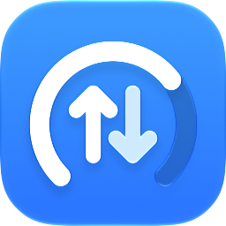
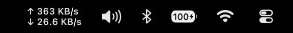

<p align="center"></p>

<h1 align="center">NetSpeed</h1>

<p align="center">A tiny macOS menu bar app that shows your live upload and download speed.</p>

---

NetSpeed sits in the menu bar and shows upload (↑) and download (↓) speed as two stacked lines, updated every second:

<p align="center"></p>

- **Lightweight.** A few hundred lines of Swift, with no dependencies, no Dock icon and no background daemons.
- **Accurate.** It reads the kernel's 64-bit interface counters (`sysctl NET_RT_IFLIST2`) for physical links only (Wi-Fi, Ethernet, cellular), so VPN and loopback traffic isn't counted twice.
- **Adapts to light and dark menu bars** automatically.
- **Idle state.** When nothing is transferring (under 1 KB/s), the readout shows a faded "idle" instead of near-zero speeds. Hover for exact speeds.
- **Data usage.** Click the item to see how much you've downloaded and uploaded today, this month and since launch. Daily and monthly totals are kept across restarts.
- **Speed test.** Choose **Run Speed Test** to measure your connection with Apple's built-in `networkQuality` tool. It takes about 20 seconds and uses a few hundred MB of data. The option is greyed out while you're offline.
- **Display options.** Show upload and download on two lines or one, or just one of them. Choose under **Display** in the menu.
- **Bytes or bits.** Show speeds in bytes (MB/s), or turn on **Show Speed in Bits** (under **Display**) to see Mbps like speed tests and ISPs.
- **Launch at Login** toggle in the menu.
- **Matches your icon style.** The app icon follows macOS's Default, Dark, Clear or Tinted icon style (macOS 26 and later).

Speeds use decimal units (1 KB = 1000 bytes, 1 Mbps = 1,000,000 bits per second), the same as most speed-test tools.

## Privacy

NetSpeed collects no data and sends nothing anywhere. It reads traffic counters that macOS already keeps, and stores your settings and usage totals only on your Mac.

The only network traffic NetSpeed itself creates is the speed test, and only when you click **Run Speed Test**. It runs Apple's `networkQuality` tool, which downloads and uploads test data to Apple's own speed-test servers on Apple's content-delivery network (hosts such as `*.aaplimg.com`), the same as running `networkQuality` in Terminal.

## Requirements

macOS 13 Ventura or later.

## Download

1. Download `NetSpeed-<version>.zip` from the [latest release](https://github.com/yashchavda96/NetSpeed/releases/latest).
2. Unzip it and move `NetSpeed.app` to your **Applications** folder.
3. Open it. NetSpeed isn't notarized by Apple, so macOS blocks it the first time:
   - **macOS 15 Sequoia and later:** click **Done** in the warning. Then open **System Settings → Privacy & Security**, scroll down, and click **Open Anyway** next to the message about NetSpeed.
   - **macOS 13–14:** right-click the app, choose **Open**, then click **Open** again.

   You only need to do this once.

## Build from source

Building yourself requires Xcode 26 or later, which compiles the app icon. With only the Command Line Tools (`xcode-select --install`) the app still builds, just without an icon. Apps you build yourself aren't blocked by macOS.

```bash
git clone https://github.com/yashchavda96/NetSpeed.git
cd NetSpeed
./build.sh
```

This compiles the app, installs it to `/Applications/NetSpeed.app`, and launches it. Running the script again replaces the running copy.

To build without installing, run:

```bash
./build.sh --no-install
```

The app is written to `build/NetSpeed.app`.

## Project layout

```
Sources/
  Traffic.swift       reads the kernel's byte counters, turns them into speeds and totals
  Usage.swift         today's and this month's totals, saved across restarts
  SpeedTest.swift     runs Apple's networkQuality speed test
  Preferences.swift   display mode, speed unit and formatting
  StatusItem.swift    the menu bar item: drawing, menu, Launch at Login
  main.swift          app entry point
AppIcon.icon          the app icon (open it in Icon Composer to edit)
build.sh              builds, signs and installs the app
```

## Uninstall

Quit NetSpeed from its menu, then delete `/Applications/NetSpeed.app`. If you turned on Launch at Login, turn it off before deleting.

To also remove its saved settings and usage totals:

```bash
defaults delete io.github.yashchavda96.netspeed
```

## A note from me

I built NetSpeed because I wanted a simple way to see my network speed, and it does exactly what I need. I don't plan to turn it into a big app with lots of features, and I hope that's okay.

Since the code is open source, you're free to take it in any direction you like: fork it, modify it, add the features you want.

If you find a genuine bug, please [open an issue](https://github.com/yashchavda96/NetSpeed/issues). I'll try to fix it when I can, or you're welcome to send a pull request. Ideas for small improvements are welcome too, as long as they keep the app simple and lightweight.

## License

[MIT](LICENSE)
